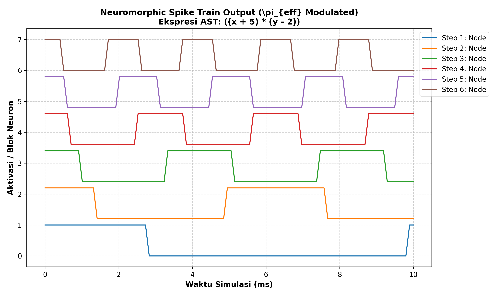

# Neuromorphic Code Optimization Compiler ($\pi_{\text{eff}}$)

Kompiler eksperimental untuk mengonversi kode program tingkat tinggi (Python AST) menjadi *Spike Train* berbasis modulasi fasa $\pi_{\text{eff}}$ untuk arsitektur *Neuromorphic Computing* (Spiking Neural Network).

## Fitur Utama
- **AST Parsing**: Menerjemahkan ekspresi matematika langsung menjadi rantai instruksi.
- **$\pi_{\text{eff}}$ Phase Modulation**: Mengodekan fasa gelombang sinyal untuk efisiensi energi dan eliminasi spike redundan.
- **Zero-Middleware Target**: Menghasilkan sinyal yang dapat dipetakan langsung ke unit neuron buatan.

## Cara Menjalankan
```bash
pip install numpy
python main.py
## Spike Train Output Visualization


